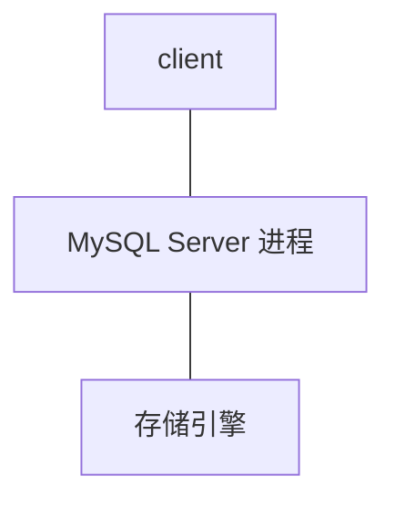

## 数据库有哪些常见索引

MySQL实现上分为：

- 聚集索引
- 非聚集索引

实际应用中分为：

- 普通索引：最基本的索引，没有任何限制，是我们经常使用到的索引
- 唯一索引：与普通索引类似，不同的是，唯一索引的列值必须唯一，但允许为空值
- 主键索引：是特殊的唯一索引，列值不允许有空值
- 联合索引：将几个列作为一条索引进行检索，使用最左匹配原则
- 全文索引：作用于CHAR，VARCHAR、TEXT数据类型的列

索引用来提高访问效率

MySQL架构

其中，client是客户端（包括jdbc，navicat之类）；中间Server包括连接器（客户端发送连接请求，用户名密码权限验证），分析器（包括词法分析和语法分析），优化器（帮助进行优化选择。join多张表，先连哪一张；5个索引，优先哪一个），执行器（与存储引擎交互）；存储引擎（持久化工具，不同的数据文件的组织形式不同，mysql中通常有myisam和innodb两种），接收执行器发送的请求，并在文件中筛选结果；查询缓存（查询的结果放入查询缓存区，以后可优先查询，mysql8后失效，原因命中率过低）

访问存储引擎即使用IO，IO操作慢，有两种方式进行改善（减少IO量/减少IO次数），索引主要需要减少IO次数。

索引要不要持久化存储，要，重建索引成本高

索引存储需要存储什么数据，包含索引字段（key）、存储数据所在的文件、存储数据所在的文件的偏移量。可存储为K-V格式。MySQL没有这样使用，当索引文件变得越来越大，效率越来越低，浪费内存空间越来越多。OLAP联机分析处理，对海量的历史数据进行分析操作，要求产生决策性影响，不要求在极短时间内返回结果，数据仓库；OLTP联机事务处理，为了支撑业务系统的需要，必须在极短的时间内返回对应的结果，关系型数据库。Hive是OLAP，使用K-V格式；MySQL是OLTP，使用什么数据结构？B+树

## 数据库设计的范式是什么

为了建立冗余较小、结构合理的数据库，设计数据库时必须遵循一定的规则。在关系型数据库中这种规则就称为范式。范式是符合某一种设计要求的总结。要想设计一个结构合理的关系型数据库，必须满足一定的范式。

在实际开发中最为常见的设计范式有三个：

1. 第一范式（列不可再分）

   

   定义：关系中每一个数据不可再分（不能以集合/序列等作为属性），也就是关系中没有重复的列（比如电话号码这个属性既存在一个手机号又存在一个家庭号码，这种情况就不属于第一范式，除非把手机号作为一个列，家庭号码也作为单独一列。）

2. 第二范式（消除部分依赖）

   

   满足2NF的前提是必须满足1NF。此外，关系模式需要包含两部分内容，一是必须有一个（及以上）主键；二是没有包含在主键中的列必须全部依赖于全部主键，而不能只依赖于主键的一部分而不依赖全部主键。

3. 第三范式（消除传递依赖）

   

   满足3NF的前提是必须满足2NF。另外关系模式的非主键列必须直接依赖于主键，不能存在传递依赖。即不能存在：非主键列m既依赖于全部主键，又依赖于非主键列n的情况。

   

