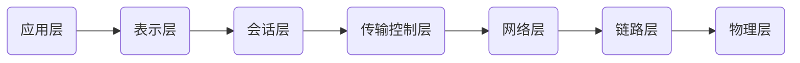
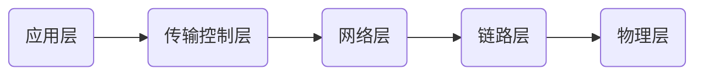

## OSI七层参考模型

OSI为七层

TCP/IP协议消减为五层，其中应用层是面向程序员来开发应用程序，传输控制层、网络层和链路层是内核给出的。

应用层程序是要准备某种协议的数据

在发送前：通过内核完成和别人的连接

nc命令，和别人建立连接，例如nc www.baidu.com 80，先打开一个netstat -natp

然后开始应用层协议的传输，客户端和服务端通信约束，这里使用http协议，先给出方法，协议版本

GET / HTTP/1.0 然后按两次回车（第一次回车是换行符作为有效数据，第二次作为请求头结束），这个就是HTTP协议约束，双方可以看懂的东西。

然后会返回响应头，响应体。

例2：nc localhost 6379

keys *

返回 *0

set k1 hello

返回 +OK

keys *

*1

$2

k1 

传输控制层：传输+控制   负责三次握手、传输数据、四次挥手

TCP协议：面向连接的可靠的传输协议（保证顺序，数据包绝对到达）

netty：粘包拆包 是和内核的queue buffer有关，不是TCP协议的问题

客户端发一个SYN给服务端

服务端回一个SYN+ACK

客户端回一个ACK

双方会在内存开辟队列空间，会有socket出现，三次握手为对方服务

TCP保证一定能发送对，且保证顺序；应用层只从socket中读取；应用程序编解码的handler负责处理从内核中取到的数据（数据可能早已发送，不是应用程序要读取时才发送数据）

TCP长连接：例nc命令时，客户端不做超时的话，会一直存在；HTTP1.0时，每个连接建立完后，请求发出去，响应回来，就断开连接，收到三个返回，不知道三个返回曾经是哪三个请求的，这里叫无状态。

TCP心跳：默认情况下没有，心跳可以配置；

客户端挂了，TCP连接会立即消失吗：不会，不知道对方已经消失；服务端需要超时时间存活，连接有了，超时时间不发送数据，要把你踢出。

分布式（微服务是分布式的子集）：都依托于TCP

socket：套接字

一端的IP:Port + 另一端的IP:Port，保证连接的唯一性

端口号port：一台电脑中最多有65535个端口号，端口号是程序的映射（系统中运行的应用程序，对应fd，fd绑定socket，socket上还会绑定队列）

服务端消耗多少个端口号：只有一个

四次分手

分手：断开连接，连接是双方内存的资源的连接，断开连接，双方要销毁资源

1. 客户端发送FIN给服务端
2. 服务端回FIN+ACK
3. 服务端发送FIN给客户端
4. 客户端回ACK

清除内存和缓冲区资源

命令curl 请求信息，例：curl www.baidu.com:80

返回打印，然后关闭自己，curl过程中完成三次握手，数据传输和四次分手

使用小工具tcpdump抓包监听，例tcpdump -nn -X -i eth0 port 80，可以看到与百度的连接

