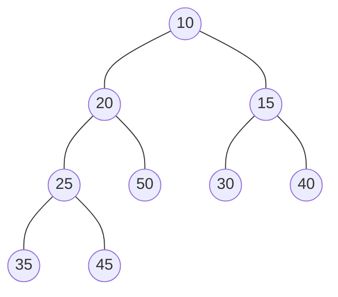

# 10亿个数中如何高效地找到最大的一个数以及最大的第K个数

这类问题统称为Top K问题，有多重解法。

1. 使用快排等可以在O(nlogn)时间复杂度内找到结果（数据量不大可以）
2. 使用快排中的partition划分思想，每次经过划分，如果中间值等于K，左边的数就是Top K的数据；如果不等于，递归处理左边或右边的数（内存问题，海量数据无法一次性将数据全部载入内存）
3. 分布式思想处理海量数据
4. 经典解法-利用堆

维护一个大小为K的小顶堆，依次将数据放入堆中，当堆的大小满了，只需将堆顶的元素与下一个数进行比较：如果大于堆顶元素，将当前堆顶元素抛弃，将元素插入堆中，遍历完全部数据，Top K元素就在堆中。

附：小顶堆：每个结点的值都**小于**或**等于**其左右孩子结点的值



求前K个最小的数，使用大顶堆

对于海量数据不用一次性全取出来，每次只取一部分，将数据一个个拿出来与堆顶比较

无论何时想要查询当前的前K大数据，都可以返回

遍历数组需要O(n)的时间复杂度，一次堆化需要O(logK)，n次为O(nlogK)，接近O(n)


### go的堆

```go
// heap.Interface
type Interface interface {
    sort.Interface
    Push(x interface{})       // 在Len()位置插入一个元素
    Pop() interface{}         // 删除并返回Len()-1位置的元素
}
```

Init用于初始化堆

```go
func Init(h Interface)
```

Fix用于对堆进行调整，接受一个堆对象以及一个位置参数i

```go
func Fix(h Interface, i int)
```

Push和Pop是一对标准堆操作，Push向堆添加一个新元素，Pop弹出并返回堆顶元素，push和pop操作不会破坏堆的结构

```go
func Push(h Interface) interface{}
func Pop(h Interface) interface{}
```

Remove用于删除堆上特定位置的元素，这个位置是指元素在堆上的排序

```go
func Remove(h Interface, i int) interface{}
```

实例

```go
package main

import (
	"container/heap"
	"fmt"
)

type IntHeap []int

func (h IntHeap) Len() int {
	return len(h)
}

func (h IntHeap) Less(i, j int) bool {
	return h[i] < h[j]
}

func (h IntHeap) Swap(i, j int) {
	h[i], h[j] = h[j], h[i]
}

func (h *IntHeap) Push(x interface{})  {
	*h = append(*h, x.(int))
}

func (h *IntHeap) Pop() interface{} {
	old := *h
	n := len(old)
	x := old[n - 1]
	*h = old[0 : n - 1]
	return x
}

func main() {
	h := &IntHeap{}
	data := []int{4,13,14,25,36,265,12,3,4,4,4,16,24,31,41,66,23,64}
	length := 10
	heap.Init(h)
	for i := 0; i < len(data); i++ {
		if h.Len() < length {
			heap.Push(h, data[i])
		} else if h.Len() == length {
			heap.Pop(h)
			heap.Push(h, data[i])
		}
	}
	fmt.Println(*h)
}
```

