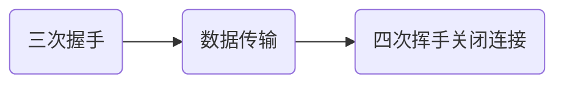
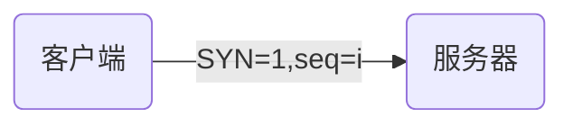
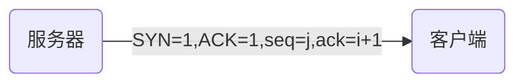
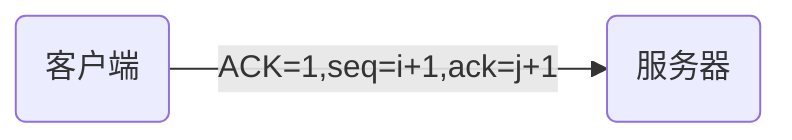
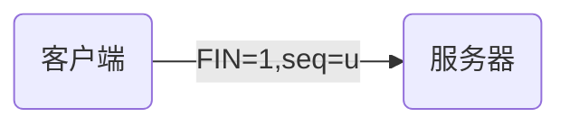
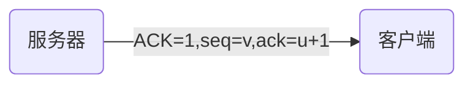
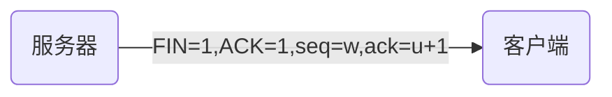
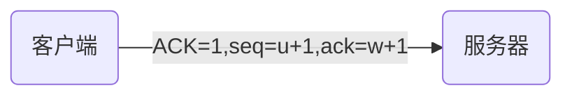

# 简述TCP三次握手以及四次挥手的流程。为什么需要三次握手以及四次挥手？

三次握手

服务端的TCP进程先创建传输控制块TCB，准备接受客户端进程的连接请求，然后服务端进程处于LISTEN状态，等待客户端的连接请求，如有，则作出响应。

1. 客户端的TCP进程也首先创建传输控制模块TCB，然后向服务端发出连接请求报文段，该报文段首部中的SYN=1，ACK=0，同时选择一个初始序号 seq=i。（TCP规定，SYN=1的报文段不能携带数据，但要消耗掉一个序号。）这时，TCP客户端进程进入SYN-SENT（同步已发送）状态，这是 TCP连接的第一次握手。TCP服务端进入SYN-RCVD（同步收到）状态，这是TCP连接的第二次握手。 
2. 服务端收到客户端发来的请求报文后，如果同意建立连接，则向客户端发送确认。确认报文中的SYN=1，ACK=1，确认号ack=i+1，同时为自己选择一个初始序号seq=j。同样该报文段也是SYN=1的报文段，不能携带数据，但同样要消耗掉一个序号。
3. TCP客户端进程收到服务端进程的确认后，还要向服务端给出确认。确认报文段的ACK=1，确认号ack=j+1，而自己的序号为seq=i+1。 TCP的标准规定，ACK报文段可以携带数据，但如果不携带数据则不消耗序号，因此，如果不携带数据，则下一个报文段的序号仍为seq=i+1。这时，TCP连接已经建立，客户端进入ESTABLISHED（已建立连接）状态。这是TCP连接的第三次握手，可以看出第三次握手客户端已经可以发送携带数据的报文段了。 当服务端收到确认后，也进入ESTABLISHED（已建立连接）状态。完成三次握手，随后Client与Server之间可以开始传输数据了。

四次挥手

1. client发送一个FIN，seq=u,告诉server：我已经不会再给你发数据了(当然，在fin包之前发送出去的数据，如果没有收到对应的ack确认报文，client依然会重发这些数据)，但是，此时client还可以接受数据。
2. server收到FIN包后，发送一个ACK=1给对方，确认序号为u+1。
3. server发送一个FIN，用来关闭server到client的数据传送，也就是告诉client，我的数据也发送完了，不会再给你发数据了。同时发送一个seq=w。
4. client收到FIN后，发送一个ACK给server，确认序号为w+1，等待服务端核实，至此，完成四次挥手。

为什么一个3次1个4次不一样？
因为两端的数据并不是同时发送完，所以两端谁发送完数据都需要自己告诉对方一次，并且对方确认一次。
